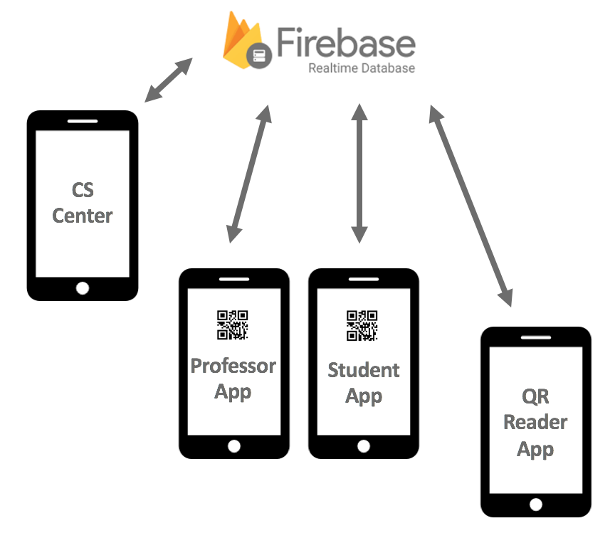
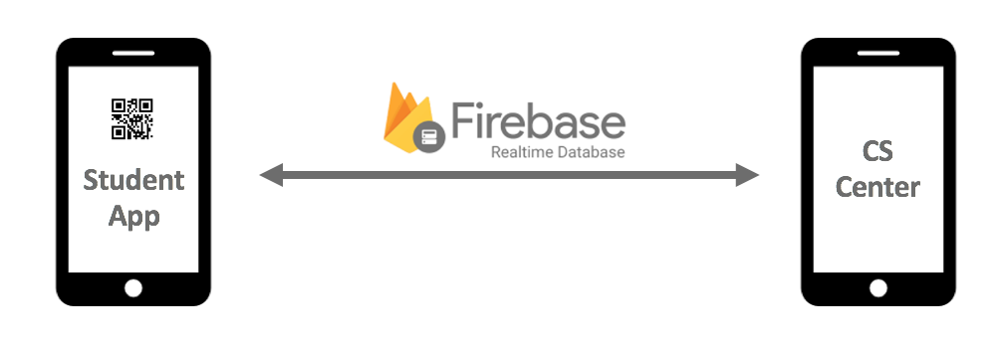
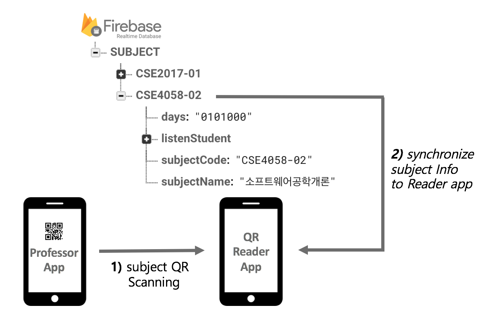
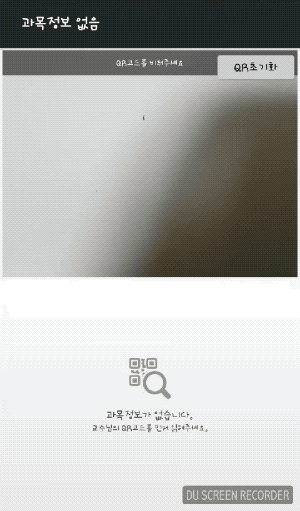
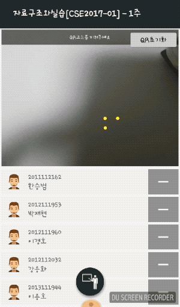
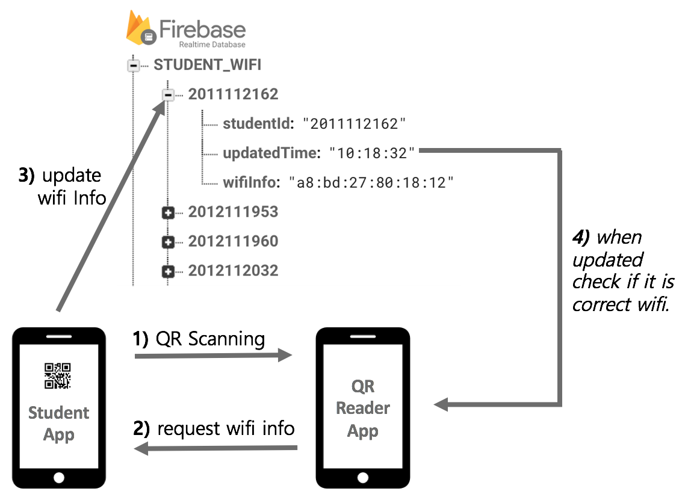
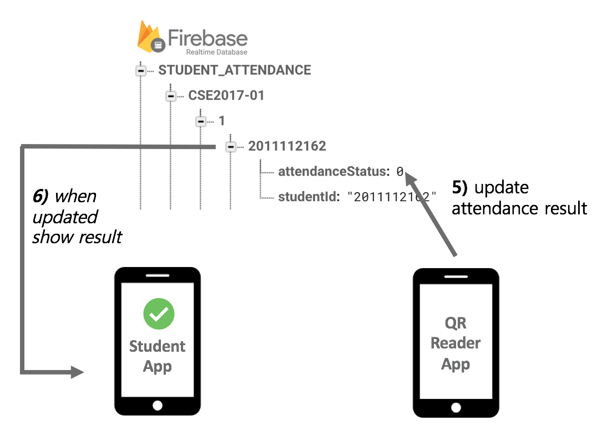
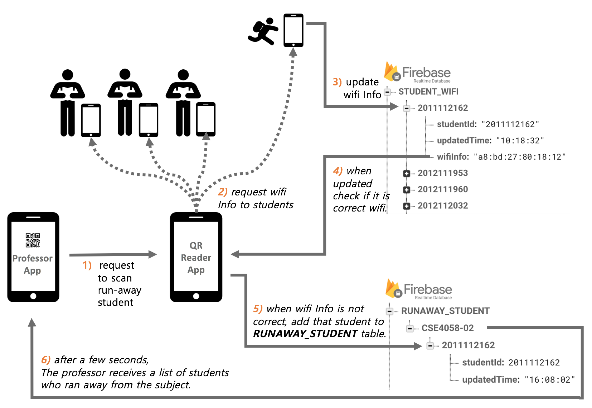

# Mobile-QR-Attendance-System
This project is team project in the subject "Software Engineering Design" at Dongguk University.

## Members 
- 한승범(Han Seung Beom) <aronix23@gmail.com>
- 배종후(Bae Jong Hoo) <qowhdgn@naver.com>
- 한재현(Han Jae Hyun) <restrain22@naver.com>

## Contents
1. [System](#system)
2. [Student Device Management](#student-device-management)
3. [Initializing the QR Reader](#initializing-the-qr-reader)
4. [Attendance Check](#attendance-check)
5. [Checking Run-away Students](#checking-run-away-students)

## System

	

The project is primarily designed using Firebase for the convenience of **real-time data** processing.
We have put the greatest emphasis on designing this system **for practical use in schools.**

There are 4 apps here and their functions are as follows.

    Cs centor App(DonggukEAS_cs)    : It allows students to register their devices.
    Qr Reader App(DonggukEAS_admin) : It recognizes QR codes of students and professors.
    Student App(DonggukEAS_client)  : It can create QR for attendance checks and view the attendance status.
    Professor App(DonggukEAS_prof)  : It enables professor to reset QR readers and see the status of students.

## Student Device Management

	

The Cs center is an app that allows students to register their devices. We felt it necessary to have a system that allows **only one device** to be registered per student to prevent the same device from abusing attendance.
  
Even if students login with the app, they can not create QR codes unless they obtain approval for the device.

## Initializing the QR Reader

    
    

Our assumptions are as follows.

    1. Each classroom has one QR reader.
    2. The professor synchronizes his QR code with the reader before starting the class.

When a professor goes into a class and reads his QR code on the reader, the QR reader is synchronized to the subject. Since then, the reader has been able to handle the students ' attendance.

## Attendance Check

    

 

We use the **Wifi strength information** to determine that the student is in the classroom because it is drastically decreased in the strength after passing through a wall. On the other hand, GPS has a lot of errors inside the building. So we did not use GPS.

    

  
When a student show the QR code to the QR reader, the reader gets student id from QR code and asks for wifi information on the student's registered device. **This method is designed to prevent the QR code from being displayed through a screen shot from other's phone.**
The student phone updates on firebase the strongest wifi signal's mac address currently being measured. The QR reader checks if a student's wifi information is valid.

    

If the wifi checked is a valid wifi, change the value of the attendanceStatus to "OK" 
Otherwise, set the value of attendanceStatus to "FAIL".
 
In the student app, which is equipped with a listener in advance, the screen shows the result of attendanceStatus

## Checking Run-away Students

    

This feature can be used when a professor wants to know a student who ran away during class and It is a feature created for a little fun.
When the professor clicks the button, the QR reader asks **students currently in class** to update their location information. and check if this student runaway or not.
Although the student would still be on the suspect list if he or she did not respond for the time limit, wethought the professor could call his name and make sure he is in the seat. :)

